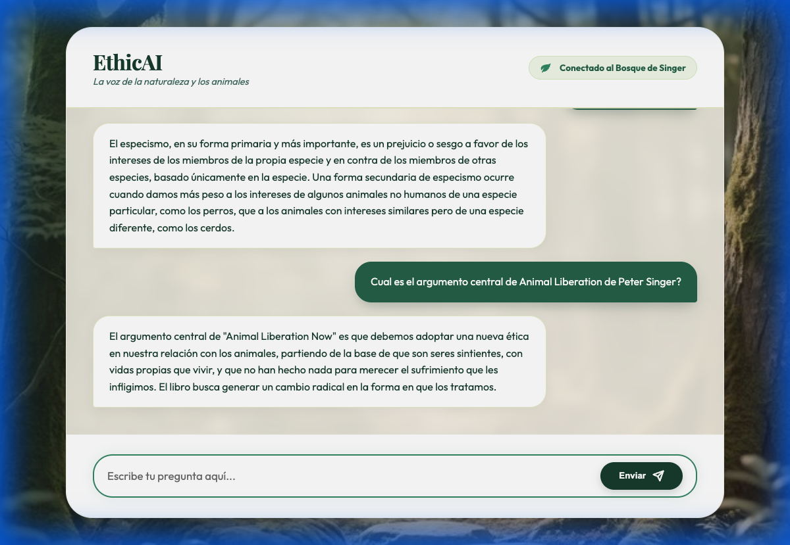

# 🎙️ EthicAI - Singer's Voice

> **Una inteligencia artificial experta en la obra de Peter Singer, específicamente en su libro "Liberación Animal".**

EthicAI ha sido diseñado para responder preguntas de manera noble, ética y protectora, basándose exclusivamente en el contexto filosófico de Peter Singer. Este proyecto utiliza técnicas de **RAG (Retrieval-Augmented Generation)** para proporcionar respuestas precisas y fundamentadas.

---

## 📸 Screenshots

| Home Interface | Chat Interaction |
| :---: | :---: |
|  |  |

---

## 🚀 Características Principales

- **RAG con Google Vertex AI**: Recuperación de información relevante de "Liberación Animal" utilizando embeddings vectoriales.
- **Gemini 2.0 Flash**: Motor de lenguaje de última generación para generar respuestas fluidas y coherentes.
- **Firestore Vector Search**: Búsqueda por similitud de vectores integrada en Google Cloud Firestore.
- **Interfaz Elegante**: Web app minimalista con estética de bosque natural, diseñada para una experiencia de usuario reflexiva.
- **Persona Noble**: Jinshi, el protector del bosque, responde siempre con sabiduría y respeto animal.

---

## 🛠️ Stack Tecnológico

- **Backend**: [FastAPI](https://fastapi.tiangolo.com/) (Python)
- **Modelos IA**: [Google Vertex AI](https://cloud.google.com/vertex-ai) (Gemini 2.0 Flash, text-embedding-004)
- **Base de Datos**: [Google Cloud Firestore](https://cloud.google.com/firestore) (con búsqueda vectorial)
- **Orquestación**: [LangChain](https://www.langchain.com/)
- **Frontend**: HTML5, CSS3, Vanilla JS (servidos estáticamente por FastAPI)

---

## ⚙️ Configuración y Ejecución Local

### Prerrequisitos

- Python 3.9+
- Una cuenta de Google Cloud con un proyecto activo.
- Credenciales de GCP configuradas localmente (`gcloud auth application-default login`).

### Pasos

1. **Clonar el repositorio**:
   ```bash
   git clone https://github.com/jlaracena/ethicAI-singers-voice.git
   cd ethicAI-singers-voice
   ```

2. **Crear y activar un entorno virtual**:
   ```bash
   python -m venv venv
   source venv/bin/activate  # En Windows: venv\Scripts\activate
   ```

3. **Instalar dependencias**:
   ```bash
   pip install -r requirements.txt
   ```

4. **Variables de Entorno**:
   Crea un archivo `.env` en la raíz del proyecto basándote en `.env.example`:
   ```env
   GOOGLE_CLOUD_PROJECT=tu-proyecto-id
   GOOGLE_CLOUD_LOCATION=us-central1
   FIRESTORE_COLLECTION=animal_liberation_chunks
   ```

5. **Ejecutar la aplicación**:
   ```bash
   python main.py
   ```
   La aplicación estará disponible en `http://localhost:8080`.

---

## ☁️ Despliegue

Este proyecto está optimizado para ser desplegado en **Google Cloud Run**. Se incluye un `Dockerfile` para facilitar el proceso de contenedorización.

```bash
gcloud run deploy ethicai-singers-voice --source .
```

---

## 📜 Licencia

Este proyecto es parte de la iniciativa **EthicAI Hub** para la protección y educación sobre los derechos de los animales.
